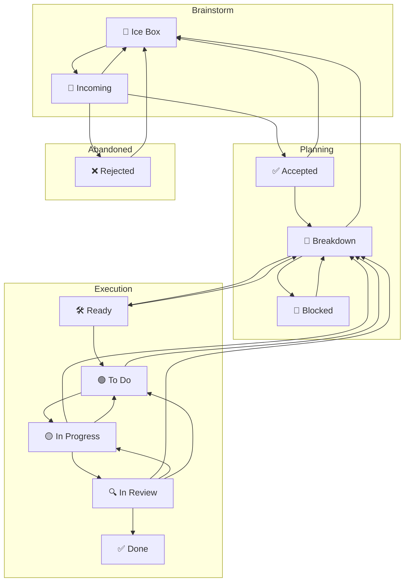

# Overview

```
1. **Intake & Associate**
```

Find or create the task; never work off-board; do not edit the board file directly—tasks drive the board. &#x20;

```
2. **Clarify & Scope**
```

Anchor on the kanban card as the single source of truth and, before advancing, do the solo pass:

- Confirm the desired outcomes so the card reflects the slice you intend to deliver.
- Capture acceptance criteria or explicit exit signals on the task so "done" is unambiguous.
- Note any uncertainties, risks, or open questions directly on the task to surface follow-ups early.
- For feature/spec work, link the backing **design** and confirm that design cites grounding research. If no design exists yet, the first slice is to *write the design*, not the feature — see [Grounding](#grounding-research--design--task).
- Record the scoped plan and supporting notes on the linked task before moving to step 3.

```
3. **Breakdown & Size**
```

Break into small, testable slices; assess **complexity, scope, and Level of Effort (LoE)** and assign a Fibonacci score from **1, 2, 3, 5, 8, 13** on the task card. Scores of **13+ ⇒ must split**; **8 ⇒ continue refinement before implementation**; **≤5 ⇒ eligible to implement**. Any score **>5** must cycle back through clarification/breakdown until the slice is small enough to implement, capturing the updated score on the task card.&#x20;

4. **Ready Gate** _(hard stop before code)_
   Only proceed if:

   - A matching task is **In Progress** (or you move it there), and WIP rules aren’t violated.&#x20;
   - The slice is scored **≤5** and fits capacity after planning; otherwise continue refinement/splitting.&#x20;
   - **Feature/spec tasks link a design that cites grounding research** (Definition of Ready). Hygiene, research, and design tasks are exempt — see [Grounding](#grounding-research--design--task).

```
5. **Implement Slice**
```

Do the smallest cohesive change that can clear gates defined in agent docs (e.g., no new ESLint errors; touched packages build; tests pass).&#x20;
When the scope is larger than the available session, carve off a reviewable subset and explicitly document what remains (e.g.,
inventory lingering files, capture blockers, link references).&#x20;

```
6. **Review → Done**
```

Move to _In Review_; when the reviewer approves **and** the global [Definition of Done](#definition-of-done-global-gates) is satisfied, advance to _Done_, recording evidence and summaries on the card. Testing and documentation are DoD gates, not their own columns.

# Grounding: Research → Design -> Decide → Task

Feature work flows down a three-layer chain, and each layer **cites the one above it**.
This is the traceability the board previously lacked: specs appeared with no design
and designs with no evidence, so "why are we building this, and is it grounded?"
had no answer on the card.

1. **Research** — grounding evidence: papers, physical derivations, prior art,
   measurements, profiling. Lives in `docs/notes/research/` and dated
   `docs/notes/*.md`. Research is *findings*, not plans.
2. **Design** — a high-level approach in `docs/designs/*.md`
  - **cites the - research it rests on** (link the note/paper).
  - Refers to resolved ADRs which support (or required) the designs drafting, if any.
  - One design backs many tasks;
  - answers *what and why*.
  - It may also ask "How?", and still be accepted, implementation pending  resolution of all unresolved architectural questions
3. **Decide** - Open architectural questions cited by a design must be resolved by an Architectural Decision Record (ADRs) `docs/adrs/*.md`and approved by the user.
-  for a task implementing features of a design to be `ready` for work, all open questions must be resolved with an approved decision.
4. **Feature task** — a `kanban/tasks/*.md` card that **references its design**
   via a `design:` frontmatter key and a `> Design: docs/designs/<file>.md`
   line in the body. The task answers *the next testable slice*.

Rules:

- **Definition of Ready (feature/spec tasks):** may enter **Ready** only if it
  links a design, and that design cites grounding research. If the design does
  not exist yet, the task's first slice is **"write the design"** (a `design`
  task), not the feature.
- **Exemptions:** mechanical/hygiene tasks (static-analysis cleanup, formatting,
  dead-code, benchmarks, no-behavior-change refactors) and pure `research` /
  `design` tasks need no upstream design link. Mark them with a
  `hygiene`, `research`, or `design` label.
- **Broken links are triage findings, not silent gaps:** a feature task whose
  `design:` points nowhere, or a design that cites no research, must be flagged
  during triage (→ Breakdown) rather than pulled into work.
- Designs should list the tasks that implement them where practical, so the
  chain is walkable in both directions.

# Kanban as a Finite State Machine (FSM)

We treat the board as an FSM over tasks.

- **States (C)**: the board’s columns.
- **Initial state (S)**: **Incoming** (new tasks land here).
- **Transitions (T)**: moves between columns.
- **Rules R(Tₙ, t)**: predicates over task `t` that permit or block transition `Tₙ`.
- **Single source of status**: each task has exactly one column/status at a time.
- **Board is law**: never edit the board file directly; tasks drive board generation.
- **WIP**: a transition fails if the target state’s WIP cap is full.

### FSM diagram



### Minimal transition rules (only what matters)

- START STATES = Ice Box | Incoming

  - All new tasks must start in either **Ice Box** (for future work) or **Incoming** (for immediate triage)
  - This constraint is enforced by the CLI to ensure proper workflow adherence
  - Tasks cannot be created directly in active columns (todo, in_progress, etc.)

- **Incoming → Accepted | Rejected | Ice Box**
  Relevance/priority triage; allow defer to Ice Box.

- **Ice Box → Incoming**
  When deferred work is ready for triage and prioritization.

- **Accepted → Breakdown | Ice Box**
  Ready to analyze, or consciously deferred.

- **Breakdown → Ready | Rejected | Ice Box | Blocked**
  Scoped & feasible → Ready; non-viable → Rejected; defer → Ice Box;
  **→ Blocked** only for a true inter-task dependency with **bidirectional links** (Blocking ⇄ Blocked By).

- **Ready → Todo**
  Prioritized into the execution queue (respect WIP).

- **Todo → In Progress**
  Pulled by a worker (respect WIP).

- **In Progress → In Review**
  Coherent, reviewable change exists.

- **In Review → Done**
  Review approved **and** the global [Definition of Done](#definition-of-done-global-gates) is satisfied. Testing and documentation are gates here, not separate columns.

- **In Progress → Todo** _session-end handoff; no PR required_
  Capacity limit reached without a reviewable change. Record artifacts/notes + next step; move to **Todo** if WIP allows; else remain **In Progress** and mark a minor blocker.
  Artifacts must include partial outputs (e.g., audit logs, findings lists, reproduction steps) so a follow-on slice can resume immediately.

- **In Progress → Breakdown**
  Slice needs re-plan or is wrong shape.

- **In Review → In Progress** _(preferred)_
  Changes requested; current assignee free; **In Progress** WIP allows.

- **In Review → Todo** _(fallback)_
  Changes requested; assignee busy **or** **In Progress** WIP full.

- **Done → (no mandatory back edge)**
  Follow-ups are modeled as new tasks (optionally seeded from Done).

- **Blocked → Breakdown** _(unblock event)_
  Fires when any linked blocker advances e.g., to In Review/Done or evidence shows dependency removed; return to Breakdown to re-plan.

## Definition of Done (global gates)

These were once their own board columns (**Testing**, **Document**). They are now
**gates every task clears on the In Review → Done transition**, not states you
move a card through. A reviewer advances a card to _Done_ only when all apply:

- **Tests pass.** The change ships with tests that exercise it, and the relevant
  suite is green (`clojure -M:test`, plus `test/architecture_test.clj` for
  structural work). Record the command and pass/fail counts on the card.
- **Static gates clean.** `bin/analyze` (or `bin/analyze --strict` for
  structural work) introduces no new warning classes in the touched files.
- **Documented.** Public vars have docstrings; the card records a short summary
  of what changed plus evidence (test output, benchmark numbers, screenshots).
  Update `docs/designs`/`docs/notes` when behavior or architecture changed.
- **Invariants intact.** 
  fan-out (no serial barrier tier), no `domain/` → `infra/` import — see
  `CLAUDE.md`. `reg/write-conflicts` empty for ECS work.

A card that fails any gate goes back to **In Progress** (or **Todo**), not to a
Testing/Document column — those no longer exist.

### Blocking policy

- **Minor blockers**: record briefly on the task; continue with other eligible work; resolve asynchronously.
  - Uncertainty over a single aspect of an assignment which does not prevent completion of other aspects of the assignment
- **Major blockers**: halt work on that task; capture evidence + attempt remediation
  - A triggered transition rule would result in a column begin over it's WIP limit
  - An agent's current task has only blocked sub tasks

## 🌊 Fluid Kanban Rule Evolution

Kanban is a fluid process that adapts to changing development environments while maintaining core principles.

### When Rules Must Change

A rule should be changed when:

1. **Progress is blocked** despite valid work being ready
2. **Team composition changes** significantly (new contributors, new agent types)
3. **Process discovery** reveals better ways of working
4. **Scaling requirements** exceed current capacity constraints

### Rule Change Process

1. **Identify the constraint**: Which specific rule is preventing forward progress?
2. **Document the rationale**: Why must this rule change now? What's the impact?
3. **Propose a new rule**: Clear, measurable, and time-bound
4. **Implement temporarily**: Test the change with explicit review date
5. **Evaluate and formalize**: Either revert, adjust, or make permanent

### WIP Limit Evolution Example

**Original Rule**: 2 tasks in review per human developer
**Reality**: 1 human + 6-18 AI agents contributing simultaneously
**Constraint**: Review bottleneck blocking all flow
**Solution**:

- Review: 2 → 6 (human review bandwidth for AI work)
- In Progress: 3 → 10 (multi-agent parallel work capacity)
- Document: 2 → 4 (maintain flow proportion)

### Guiding Principles for a Supportive Board

- **The board serves the team, not the other way around**
- **Work gets done, sometimes outside formal processes - and that's okay**
- **Retrospective card movement is a ritual of acknowledgment, not compliance**
- **Failed checks are learning opportunities, not violations**
- **We think better when we're calm** - even urgent work deserves a thoughtful response
- **Focus on capacity and flow** - "We may have taken on more work than we can handle, let's reevaluate priorities"

- **Rules enable flow, they don't dictate activity**
- **Change is temporary unless proven valuable**
- **Document every change with clear rationale**
- **Review changes regularly** (monthly for significant rule changes)
- **Maintain the spirit** of the rule even when adapting the letter
