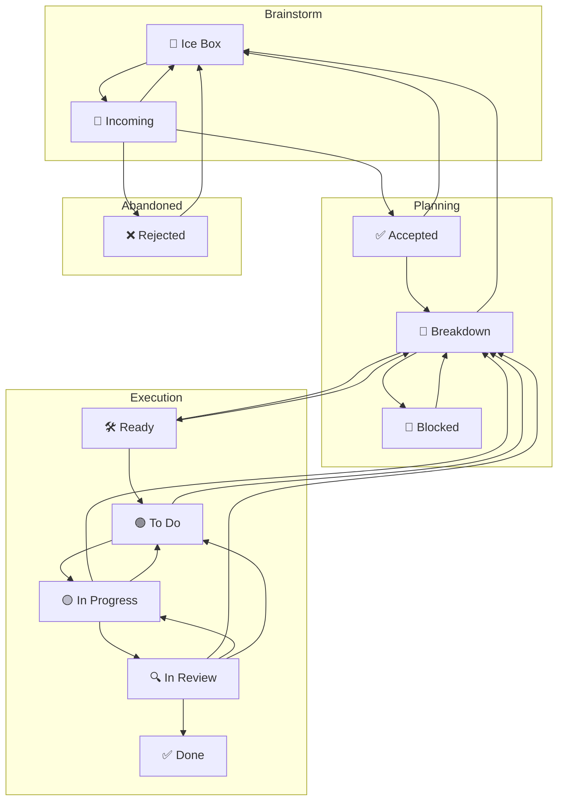

# Kanban Agile Workflow

All feature work, and significant chores require a task file to have worked through each phase
of the above process to the and be in the `todo` status to be eligible for
implementation work and the transition to the `in_progress` status

If you are asked to work on a task that is not marked `todo` *YOU MUST* read @PROCESS.md and focus on moving the card through the process,
one status transition at a time until you are either blocked, or the you make the transition from `in_progress` to `review` after
all tests pass, and lint passes with 0 errors, or warnings.

We pick up after each other, resolve warnings even if it's not your fault.
Do you like having to swim through trash to do your job?

```md
---
uuid: "shared-kondo-config-wire-axxium"
title: "Wire shared clj-kondo config into axxium"
status: "done"
priority: "P1"
labels: ["tasks", "lint", "clj-kondo", "infra", "1sp"]
created_at: "2026-06-15T00:00:00Z"
source: "kanban/epics/shared-kondo-config-install.md"
points: 1
category: "tasks"
---
```


- **Work from a card.** Never work off-board. Anchor every implementation slice on a kanban task and record the scoped plan on the card before moving to implementation.
- **Move cards with the Rheos CLI.** Run commands from the **repo root** so the board resolves correctly:
  - `eta-mu kanban list` — current board.
  - `eta-mu kanban count` — column counts.
  - `eta-mu kanban comment <uuid> "note"` — append provenance to a card.
  - `eta-mu kanban frontmatter <uuid> status <new-status>` — lawful status change.
  - `node packages/Rheos/dist/cli.cjs status-update <uuid> --to <status>` — FSM-enforced move (also runs build-gate when required).
- **No direct frontmatter edits.** The file watcher treats hand-edited frontmatter as drift and stamps a `drift: true` indicator on the card. Use the CLI so the ledger records a `write-id` and the provenance is auditable.
- **Walk lawful hops.** There are no shortcut edges. To move a card multiple columns forward, step through each lawful transition in order. The direct `in_progress → review` edge exists only when the build-gate passes.
- **Regenerate snapshots when needed.** The web UI and `kanban/.kanban/board.json` are generated snapshots; the source of truth is the task files plus the ledger in `kanban/.events/ledger.edn`. If a snapshot is stale, regenerate it from the CLI or the web UI.
- All other guidelines live in the living `PROCESS.md` document, 

## Kanban Core Principles

For a kanban to be more than a board with named columns full of cards with text,
there must be a predictable process behind that board.

- **States (C)**: the board’s columns.
- **Initial state (S)**: **Incoming** (new tasks land here).
- **Transitions (T)**: moves between columns.
- **Rules R(Tₙ, t)**: predicates over task `t` that permit or block transition `Tₙ`.
- **Single source of status**: each task has exactly one column/status at a time.
- **Board is law**: never edit the board file directly; tasks drive board generation.
- **WIP**: a transition fails if the target state’s WIP cap is full.

## Workflow State Transition Diagram

When updating a tasks status, you must respect the transition rules.
Tasks may only transition from their current status, to a status it has ana
arrow to in following workflow diagram.

In addition to tasks being limited to what statuses they can transition to from their
current state, each transition has conditions that must be met to be allowed.




## Minimal transition rules (only what matters)

- START STATES = Ice Box | Incoming

  - All new tasks must start in either **Ice Box** (for future work) or **Incoming** (for immediate triage)
  - This constraint is enforced by the CLI to ensure proper workflow adherence
  - Tasks cannot be created directly in active columns (todo, in_progress, etc.)

- **Incoming → Accepted | Rejected | Ice Box**
  Relevance/priority triage; allow defer to Ice Box.

- **Ice Box → Incoming**
  When deferred work is ready for triage and prioritization.

- **Accepted → Breakdown | Ice Box**
  Ready to analyze, or consciously deferred.

- **Breakdown → Ready | Rejected | Ice Box | Blocked**
  Scoped & feasible → Ready; non-viable → Rejected; defer → Ice Box;
  **→ Blocked** only for a true inter-task dependency with **bidirectional links** (Blocking ⇄ Blocked By).

- **Ready → Todo**
  Prioritized into the execution queue (respect WIP).

- **Todo → In Progress**
  Pulled by a worker (respect WIP).

- **In Progress → In Review**
  Coherent, reviewable change exists.

- **In Review → Done**
  Review approved **and** the global [Definition of Done](#definition-of-done-global-gates) is satisfied. Testing and documentation are gates here, not separate columns.

- **In Progress → Todo** _session-end handoff; no PR required_
  Capacity limit reached without a reviewable change. Record artifacts/notes + next step; move to **Todo** if WIP allows; else remain **In Progress** and mark a minor blocker.
  Artifacts must include partial outputs (e.g., audit logs, findings lists, reproduction steps) so a follow-on slice can resume immediately.

- **In Progress → Breakdown**
  Slice needs re-plan or is wrong shape.

- **In Review → In Progress** _(preferred)_
  Changes requested; current assignee free; **In Progress** WIP allows.

- **In Review → Todo** _(fallback)_
  Changes requested; assignee busy **or** **In Progress** WIP full.

- **Done → (no mandatory back edge)**
  Follow-ups are modeled as new tasks (optionally seeded from Done).

- **Blocked → Breakdown** _(unblock event)_
  Fires when any linked blocker advances e.g., to In Review/Done or evidence shows dependency removed; return to Breakdown to re-plan.


## 🌊 Fluid Kanban Rule Evolution

Kanban is a fluid process that adapts to changing development environments while maintaining core principles.

### When Rules Must Change

A rule should be changed when:

1. **Progress is blocked** despite valid work being ready
2. **Team composition changes** significantly (new contributors, new agent types)
3. **Process discovery** reveals better ways of working
4. **Scaling requirements** exceed current capacity constraints

### Rule Change Process

1. **Identify the constraint**: Which specific rule is preventing forward progress?
2. **Document the rationale**: Why must this rule change now? What's the impact?
3. **Propose a new rule**: Clear, measurable, and time-bound
4. **Implement temporarily**: Test the change with explicit review date
5. **Evaluate and formalize**: Either revert, adjust, or make permanent

### WIP Limit Evolution Example

**Original Rule**: 2 tasks in review per human developer
**Reality**: 1 human + 6-18 AI agents contributing simultaneously
**Constraint**: Review bottleneck blocking all flow
**Solution**:

- Review: 2 → 6 (human review bandwidth for AI work)
- In Progress: 3 → 10 (multi-agent parallel work capacity)
- Document: 2 → 4 (maintain flow proportion)

### Guiding Principles for a Supportive Board

- **The board serves the team, not the other way around**
- **Work gets done, sometimes outside formal processes - and that's okay**
- **Retrospective card movement is a ritual of acknowledgment, not compliance**
- **Failed checks are learning opportunities, not violations**
- **We think better when we're calm** - even urgent work deserves a thoughtful response
- **Focus on capacity and flow** - "We may have taken on more work than we can handle, let's reevaluate priorities"

- **Rules enable flow, they don't dictate activity**
- **Change is temporary unless proven valuable**
- **Document every change with clear rationale**
- **Review changes regularly** (monthly for significant rule changes)
- **Maintain the spirit** of the rule even when adapting the letter


