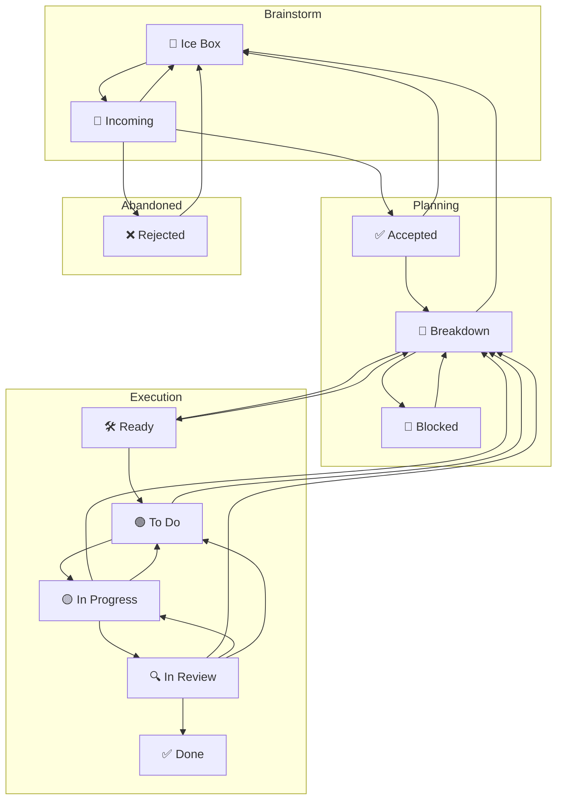

# Kanban Workflow

- **States (C)**: the board’s columns.
- **Initial state (S)**: **Incoming** (new tasks land here).
- **Transitions (T)**: moves between columns.
- **Rules R(Tₙ, t)**: predicates over task `t` that permit or block transition `Tₙ`.
- **Single source of status**: each task has exactly one column/status at a time.
- **Board is law**: never edit the board file directly; tasks drive board generation.
- **WIP**: a transition fails if the target state’s WIP cap is full.

### Workflow State Transition Diagram

When updating a tasks status, you must respect the transition rules.
Tasks may only transition from their current status, to a status it has ana
arrow to in following workflow diagram.

In addition to tasks being limited to what statuses they can transition to from their
current state, each transition has conditions that must be met to be allowed.

